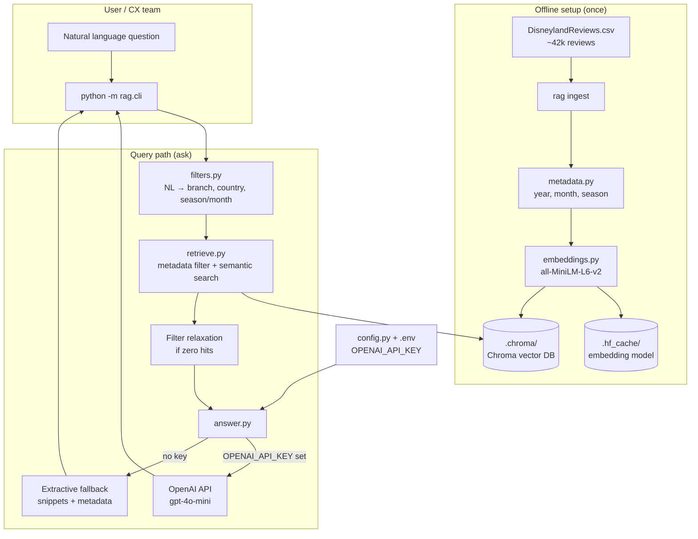
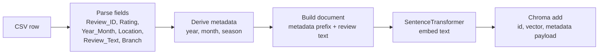
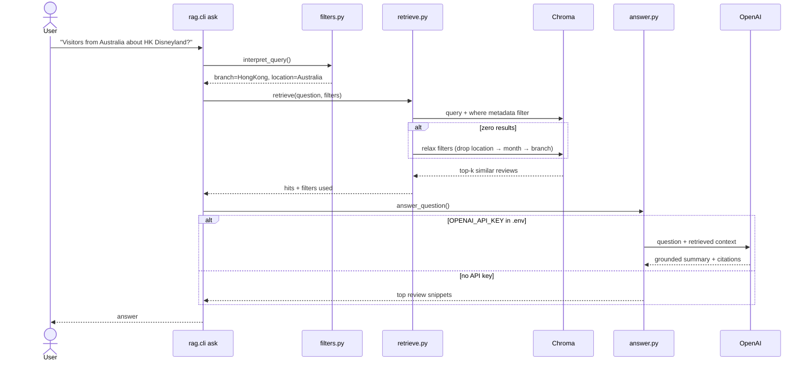

# RAGnaRock

RAGnaRock: Build RAG systems that actually survive production.

This project is a **Retrieval-Augmented Generation (RAG)** system over the **Disneyland Reviews** dataset. The customer experience team can ask open-ended natural language questions that use both **review text** and **structured metadata** (park, visitor country, visit date, rating).

## Example questions

- What do visitors from Australia say about Disneyland in Hong Kong?
- Is spring a good time to visit Disneyland?
- Is Disneyland California usually crowded in June?
- Is the staff in Paris friendly?

## Dataset

Place `DisneylandReviews.csv` under `dataset/` (not committed by default). Columns:

| Column | Description |
|--------|-------------|
| `Review_ID` | Unique review identifier |
| `Rating` | 1–5 stars |
| `Year_Month` | Visit period (e.g. `2019-4`; some rows are `missing`) |
| `Reviewer_Location` | Visitor country/region |
| `Review_Text` | Free-text review |
| `Branch` | `Disneyland_California`, `Disneyland_Paris`, or `Disneyland_HongKong` |

## Architecture

### High-level



### Ingest pipeline



Each stored point includes **text + metadata**: `branch`, `reviewer_location`, `rating`, `year`, `month`, `season`, `year_month`, `review_id`.

### Ask pipeline



### Text + metadata together

| Layer | Role |
|--------|------|
| **Metadata filters** | Narrow by park (`Branch`), visitor country (`Reviewer_Location`), month/season |
| **Dense retrieval** | Semantic match on review text (crowding, staff, weather, rides, etc.) |
| **Document prefix** | Embeds metadata into each chunk so similarity aligns with structured fields |
| **Relaxation** | If filters are too strict, drops constraints stepwise so you still get evidence |
| **Generation** | LLM summarizes retrieved reviews only; cites Review IDs when `OPENAI_API_KEY` is set |

## Quick start

### 1. Create a virtual environment and install dependencies

```bash
cd RAGnaRock
python3 -m venv .venv
source .venv/bin/activate
pip install -r requirements.txt
```

### 2. Add the dataset

Put your CSV at `dataset/DisneylandReviews.csv`.

### 3. Build the index (one-time, or after data changes)

```bash
python -m rag.cli ingest --reset
```

This downloads the embedding model on first run (cached under `.hf_cache/`) and writes vectors to `.chroma/`. Expect a few minutes for ~42k reviews.

### 4. Ask questions

```bash
python -m rag.cli ask "What do visitors from Australia say about Hong Kong Disneyland?" -k 20
```

Debug metadata inference without retrieval:

```bash
python -m rag.cli show-filters "Is Disneyland California crowded in June?"
```

## CLI reference

| Command | Description |
|---------|-------------|
| `python -m rag.cli ingest [--reset]` | Embed CSV into local Chroma DB |
| `python -m rag.cli ask "..." [-k 20]` | Retrieve reviews and generate an answer |
| `python -m rag.cli show-filters "..."` | Print inferred branch / location / months |

Options:

- `ingest --csv PATH` — override default `dataset/DisneylandReviews.csv`
- `ingest --reset` — delete and rebuild the collection
- `ask -k N` — number of chunks to retrieve (default 20)

## OpenAI API key (optional)

Without a key, `ask` returns **top retrieved snippets** (extractive fallback). With a key, answers are **grounded summaries** with Review ID citations.

### Recommended: `.env` in the repo root

Create `.env` (already gitignored):

```bash
OPENAI_API_KEY=sk-...
# optional:
OPENAI_MODEL=gpt-4o-mini
```

`rag/config.py` loads this via `python-dotenv` on startup.

### Alternative: shell export

```bash
export OPENAI_API_KEY="sk-..."
python -m rag.cli ask "Is the staff in Paris friendly?"
```

`export` sets a variable for the **current terminal session** and passes it to child processes (e.g. Python). It does not persist in new terminals unless you add it to `~/.zshrc`.

### Handling secrets safely

| Environment | Approach |
|-------------|----------|
| **Local dev** | Gitignored `.env` (default here) |
| **Production** | Cloud secret manager (AWS Secrets Manager, GCP Secret Manager, Vault, etc.) injected as env vars at runtime |
| **CI** | Platform secrets (GitHub Actions secrets, etc.); never commit keys |

Rules: never commit secrets; rotate if leaked; use separate keys per environment; prefer env vars over hardcoding.

## Project layout

```
RAGnaRock/
├── dataset/DisneylandReviews.csv   # your data (not in git by default)
├── rag/
│   ├── cli.py          # ingest / ask / show-filters
│   ├── config.py       # paths, HF cache, .env loading
│   ├── embeddings.py   # SentenceTransformer + offline cache detection
│   ├── filters.py      # NL → metadata (branch, location, season/month)
│   ├── ingest.py       # CSV → Chroma
│   ├── metadata.py     # year/month/season parsing
│   ├── retrieve.py     # filtered vector search + relaxation
│   └── answer.py       # OpenAI or extractive fallback
├── .chroma/            # vector index (gitignored)
├── .hf_cache/          # embedding model cache (gitignored)
├── .env                # secrets (gitignored)
└── requirements.txt
```

## Evaluating quality

Use several layers so you catch retrieval and generation failures:

1. **Gold Q&A set** — 30–80 hand-written questions (branch, location, season, staff, crowding) with reference answers or must-cite Review IDs.
2. **Retrieval metrics** — recall@k / nDCG: did the right reviews appear in top-k?
3. **Answer metrics** — LLM-as-judge groundedness, relevance, faithfulness; human spot-checks on a sample.
4. **Metadata stress tests** — questions that differ only by branch or month; answers should change when filters change.
5. **Ablation** — dense-only vs metadata filters vs filter relaxation; measure where gains come from.

## Troubleshooting

**Hugging Face / proxy errors on `ask`**

- After a successful `ingest`, the model should load from `.hf_cache/` with `local_files_only=True`.
- If requests still fail, try `unset HTTP_PROXY HTTPS_PROXY` in that shell.

**Slow first `ask`**

- Loading `sentence-transformers/all-MiniLM-L6-v2` can take 1–2 minutes cold; later runs in the same shell are faster.

**Sparse filter combinations**

- Few reviews for a given country + park + month may trigger **filter relaxation** (noted in CLI output). The answer should reflect limited evidence.

**Duplicate `Review_ID` in CSV**

- Ingest uses stable Chroma ids `{review_id}-{row_index}` so duplicates do not break indexing.

## License

See repository defaults; dataset usage subject to your source terms.
