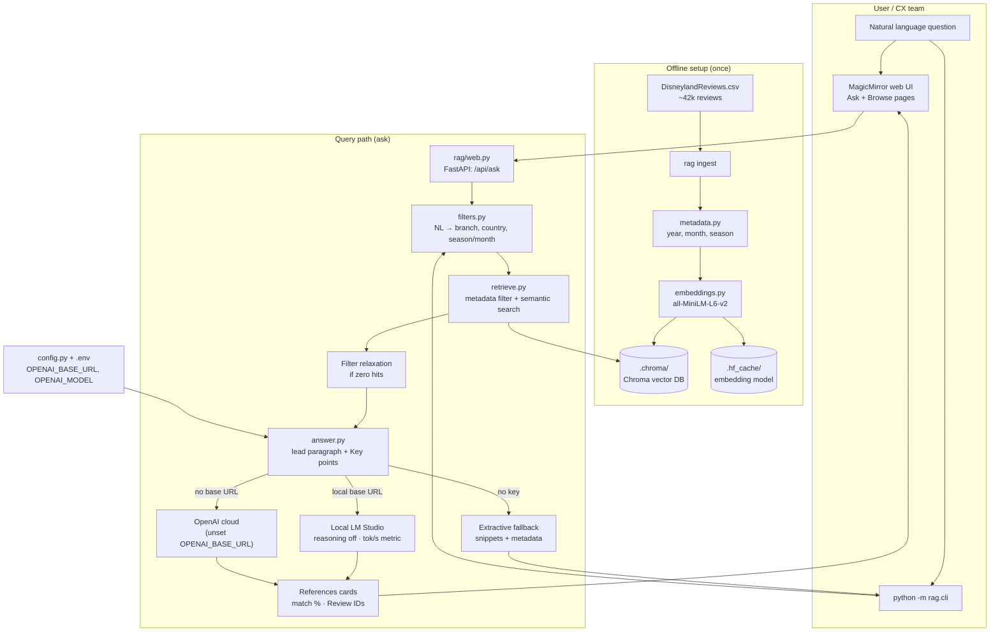
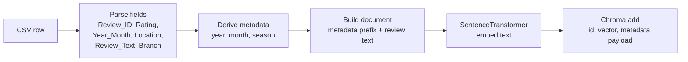
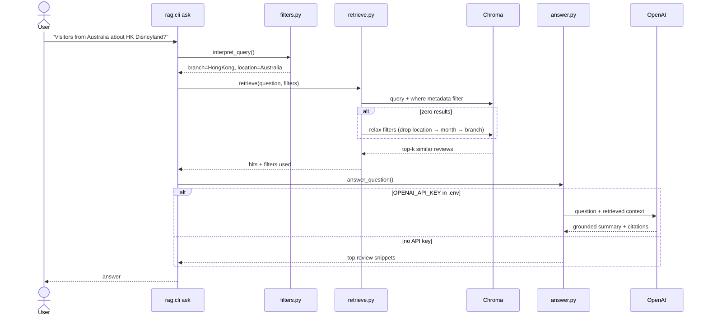
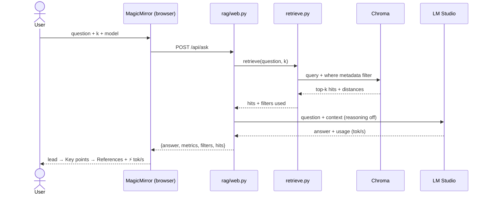

# MagicMirror ✨🪞

**Ask anything about Disneyland reviews (grounded in 42,656 real guest reviews).**

RAGnaRock is a **Retrieval-Augmented Generation (RAG)** system over the **Disneyland Reviews** dataset. The customer experience team can ask open-ended natural language questions that use both **review text** and **structured metadata** (park, visitor country, visit date, rating) — through a web app, and with a local LLM so no API key is needed.

```bash
.venv/bin/python -m uvicorn rag.web:app --port 8000
# → http://127.0.0.1:8000 (Ask) · http://127.0.0.1:8000/browse (Browse)
```

## Example questions

- What do visitors from Australia say about Disneyland in Hong Kong?
- Is spring a good time to visit Disneyland?
- Is Disneyland California usually crowded in June?
- Is the staff in Paris friendly?

## Dataset

Place `DisneylandReviews.csv` under `dataset/` (not committed by default). Columns:

| Column | Description |
|--------|-------------|
| `Review_ID` | Unique review identifier |
| `Rating` | 1–5 stars |
| `Year_Month` | Visit period (e.g. `2019-4`; some rows are `missing`) |
| `Reviewer_Location` | Visitor country/region |
| `Review_Text` | Free-text review |
| `Branch` | `Disneyland_California`, `Disneyland_Paris`, or `Disneyland_HongKong` |

## Architecture

### High-level


```mermaid
flowchart TB
    subgraph User["User / CX team"]
        Q["Natural language question"]
        WEB["MagicMirror web UI\nAsk + Browse pages"]
        CLI["python -m rag.cli"]
    end

    subgraph Offline["Offline setup (once)"]
        CSV["DisneylandReviews.csv\n~42k reviews"]
        INGEST["rag ingest"]
        META["metadata.py\nyear, month, season"]
        EMB["embeddings.py\nall-MiniLM-L6-v2"]
        CHROMA[(".chroma/\nChroma vector DB")]
        HF[(".hf_cache/\nembedding model")]
    end

    subgraph Online["Query path (ask)"]
        API["rag/web.py\nFastAPI: /api/ask"]
        FILTERS["filters.py\nNL → branch, country, season/month"]
        RET["retrieve.py\nmetadata filter + semantic search"]
        RELAX["Filter relaxation\nif zero hits"]
        ANS["answer.py\nlead paragraph + Key points"]
        LLM["Local LM Studio\nreasoning off · tok/s metric"]
        OAI["OpenAI cloud\n(unset OPENAI_BASE_URL)"]
        FALL["Extractive fallback\nsnippets + metadata"]
        REF["References cards\nmatch % · Review IDs"]
    end

    CONFIG["config.py + .env\nOPENAI_BASE_URL, OPENAI_MODEL"]

    CSV --> INGEST
    INGEST --> META
    META --> EMB
    EMB --> HF
    EMB --> CHROMA

    Q --> WEB
    Q --> CLI
    WEB --> API
    CLI --> FILTERS
    API --> FILTERS
    FILTERS --> RET
    RET --> CHROMA
    RET --> RELAX
    RELAX --> ANS
    CONFIG --> ANS
    ANS -->|local base URL| LLM
    ANS -->|no base URL| OAI
    ANS -->|no key| FALL
    LLM --> REF
    OAI --> REF
    FALL --> CLI
    REF --> WEB
```

### Ingest pipeline


```mermaid
flowchart LR
    ROW["CSV row"] --> PARSE["Parse fields\nReview_ID, Rating,\nYear_Month, Location,\nReview_Text, Branch"]
    PARSE --> ENRICH["Derive metadata\nyear, month, season"]
    ENRICH --> DOC["Build document\nmetadata prefix + review text"]
    DOC --> VEC["SentenceTransformer\nembed text"]
    VEC --> STORE["Chroma add\nid, vector, metadata payload"]
```

Each stored point includes **text + metadata**: `branch`, `reviewer_location`, `rating`, `year`, `month`, `season`, `year_month`, `review_id`.

### Ask pipeline


```mermaid
sequenceDiagram
    actor User
    participant CLI as rag.cli ask
    participant F as filters.py
    participant R as retrieve.py
    participant C as Chroma
    participant A as answer.py
    participant LLM as OpenAI

    User->>CLI: "Visitors from Australia about HK Disneyland?"
    CLI->>F: interpret_query()
    F-->>CLI: branch=HongKong, location=Australia
    CLI->>R: retrieve(question, filters)
    R->>C: query + where metadata filter
    alt zero results
        R->>C: relax filters (drop location → month → branch)
    end
    C-->>R: top-k similar reviews
    R-->>CLI: hits + filters used
    CLI->>A: answer_question()
    alt OPENAI_API_KEY in .env
        A->>LLM: question + retrieved context
        LLM-->>A: grounded summary + citations
    else no API key
        A-->>CLI: top review snippets
    end
    CLI-->>User: answer
```

### Web request path

The browser never touches Chroma or the LLM directly — `rag/web.py` reuses the same pipeline and returns JSON:


```mermaid
sequenceDiagram
    actor User
    participant UI as MagicMirror (browser)
    participant API as rag/web.py
    participant R as retrieve.py
    participant C as Chroma
    participant LLM as LM Studio

    User->>UI: question + k + model
    UI->>API: POST /api/ask
    API->>R: retrieve(question, k)
    R->>C: query + where metadata filter
    C-->>R: top-k hits + distances
    R-->>API: hits + filters used
    API->>LLM: question + context (reasoning off)
    LLM-->>API: answer + usage (tok/s)
    API-->>UI: {answer, metrics, filters, hits}
    UI-->>User: lead → Key points → References + ⚡ tok/s
```

### Text + metadata together

| Layer | Role |
|--------|------|
| **Metadata filters** | Narrow by park (`Branch`), visitor country (`Reviewer_Location`), month/season |
| **Dense retrieval** | Semantic match on review text (crowding, staff, weather, rides, etc.) |
| **Document prefix** | Embeds metadata into each chunk so similarity aligns with structured fields |
| **Relaxation** | If filters are too strict, drops constraints stepwise so you still get evidence |
| **Generation** | LLM summarizes retrieved reviews only; cites Review IDs when `OPENAI_API_KEY` is set |

## Quick start

### 1. Create a virtual environment and install dependencies

```bash
cd RAGnaRock
python3 -m venv .venv
source .venv/bin/activate
pip install -r requirements.txt
```

### 2. Add the dataset

Put your CSV at `dataset/DisneylandReviews.csv`.

### 3. Build the index (one-time, or after data changes)

```bash
python -m rag.cli ingest --reset
```

This downloads the embedding model on first run (cached under `.hf_cache/`) and writes vectors to `.chroma/`. Expect a few minutes for ~42k reviews.

### 4. Ask questions

```bash
python -m rag.cli ask "What do visitors from Australia say about Hong Kong Disneyland?" -k 20
```

Debug metadata inference without retrieval:

```bash
python -m rag.cli show-filters "Is Disneyland California crowded in June?"
```

### 5. Launch the web app (MagicMirror)

```bash
.venv/bin/python -m uvicorn rag.web:app --port 8000
```

- **Ask** (`/`) — search box + examples, k slider, model picker, dark/light mode, filter pills, lead-paragraph answer, Key-points section, References cards with `◎ %` match scores, and a `⚡ tok/s` perf pill.
- **Browse** (`/browse`) — collection stats (totals, park/rating/location bars), park + rating + text filters, paged record table, expandable full text, and per-record **embedding inspector** (dim, L2 norm, magnitude bars, raw values).

## API reference

| Route | Description |
|-------|-------------|
| `GET /` | Ask page |
| `GET /browse` | Browse page |
| `GET /api/health` | Liveness |
| `GET /api/stats` | Index count, branches, local models, LLM status |
| `GET /api/filters?q=…` | Debug NL → metadata mapping |
| `POST /api/ask` | `{question, k, model?}` → `{answer, llm_failed, metrics, filters, hits, count}` |
| `GET /api/collections` | Collections + counts |
| `GET /api/chroma-stats?collection=…` | Branch/rating/year/location distributions (5-min cache) |
| `GET /api/browse?collection=&limit=&offset=&q=&branch=&rating=` | Paged records (`q` → `where_document $contains`) |
| `GET /api/record?collection=&id=&vectors=` | Full document + metadata, optionally the 384-dim embedding |

## CLI reference

| Command | Description |
|---------|-------------|
| `python -m rag.cli ingest [--reset]` | Embed CSV into local Chroma DB |
| `python -m rag.cli ask "..." [-k 20]` | Retrieve reviews and generate an answer |
| `python -m rag.cli show-filters "..."` | Print inferred branch / location / months |

Options:

- `ingest --csv PATH` — override default `dataset/DisneylandReviews.csv`
- `ingest --reset` — delete and rebuild the collection
- `ask -k N` — number of chunks to retrieve (default 20)

## LLM setup: local LM Studio (default) or OpenAI cloud

The app speaks the OpenAI API shape, so one `.env` covers both. Local is the default — no key needed (any placeholder value works; LM Studio ignores it):

```bash
OPENAI_API_KEY=lm-studio
OPENAI_BASE_URL=http://127.0.0.1:1235/v1
OPENAI_MODEL=qwen/qwen3.5-9b
LLM_MAX_TOKENS=1500
# LLM_REASONING_EFFORT=none   # default for local runtimes; "auto" omits it
```

Unset `OPENAI_BASE_URL` (and set a real key + `OPENAI_MODEL=gpt-4o-mini`) to use OpenAI cloud instead.

Without any key, `ask` returns **top retrieved snippets** (extractive fallback). Local reasoning models think for thousands of tokens before answering, so the app sends `reasoning_effort: none` to local runtimes — otherwise the token budget burns in deliberation and the answer comes back empty.

### Handling secrets safely

| Environment | Approach |
|-------------|----------|
| **Local dev** | Gitignored `.env` (default here) |
| **Production** | Cloud secret manager (AWS Secrets Manager, GCP Secret Manager, Vault, etc.) injected as env vars at runtime |
| **CI** | Platform secrets (GitHub Actions secrets, etc.); never commit keys |

Rules: never commit secrets; rotate if leaked; use separate keys per environment; prefer env vars over hardcoding.

## Project layout

```
RAGnaRock/
├── dataset/DisneylandReviews.csv   # your data (not in git by default)
├── rag/
│   ├── cli.py          # ingest / ask / show-filters
│   ├── web.py          # FastAPI: pages + /api/* (same pipeline as CLI)
│   ├── config.py       # paths, HF cache, .env loading
│   ├── embeddings.py   # SentenceTransformer + offline cache detection
│   ├── filters.py      # NL → metadata (branch, location, season/month)
│   ├── ingest.py       # CSV → Chroma
│   ├── metadata.py     # year/month/season parsing
│   ├── retrieve.py     # filtered vector search + relaxation
│   └── answer.py       # local/cloud LLM or extractive fallback (+tok/s)
├── web/
│   ├── index.html      # Ask page (MagicMirror)
│   ├── browse.html     # Browse page (stats, table, embeddings)
│   ├── app.js          # ask + answer rendering (lead/Key points/References)
│   ├── browse.js       # stats bars, filters, paging, vector inspector
│   └── styles.css      # dark/light themes
├── .chroma/            # vector index (gitignored)
├── .hf_cache/          # embedding model cache (gitignored)
├── .env                # secrets + LLM endpoint (gitignored)
└── requirements.txt
```

## Answer format

Every LLM answer follows the same contract (enforced by prompt + sanitizer + UI):

1. **Lead paragraph** — the direct answer in 2–4 sentences, no bold, no asterisks.
2. **Key points** — one card per supporting point, each with a verbatim quote + Review ID.
3. **References** — the retrieved reviews as cards/table rows with `◎ %` match scores and Review IDs.

## Evaluating quality

Use several layers so you catch retrieval and generation failures:

1. **Gold Q&A set** — 30–80 hand-written questions (branch, location, season, staff, crowding) with reference answers or must-cite Review IDs.
2. **Retrieval metrics** — recall@k / nDCG: did the right reviews appear in top-k?
3. **Answer metrics** — LLM-as-judge groundedness, relevance, faithfulness; human spot-checks on a sample.
4. **Metadata stress tests** — questions that differ only by branch or month; answers should change when filters change.
5. **Ablation** — dense-only vs metadata filters vs filter relaxation; measure where gains come from.

## Troubleshooting

**Hugging Face / proxy errors on `ask`**

- After a successful `ingest`, the model should load from `.hf_cache/` with `local_files_only=True`.
- If requests still fail, try `unset HTTP_PROXY HTTPS_PROXY` in that shell.

**Slow first `ask`**

- Loading `sentence-transformers/all-MiniLM-L6-v2` can take 1–2 minutes cold; later runs in the same shell are faster.

**Sparse filter combinations**

- Few reviews for a given country + park + month may trigger **filter relaxation** (noted in CLI output). The answer should reflect limited evidence.

**Duplicate `Review_ID` in CSV**

- Ingest uses stable Chroma ids `{review_id}-{row_index}` so duplicates do not break indexing.

**Ports at a glance**

- `8000` MagicMirror web app · `8001` Chroma server (if you run `chroma run`) · `1235` LM Studio. If a page won't load, check the right port is serving (`curl …/api/health`) and use `http://`, not `https://`.

**Empty answers from a local model**

- Reasoning models burn the token budget thinking. The app already sends `reasoning_effort: none` to local runtimes; if you changed `LLM_REASONING_EFFORT`, raise `LLM_MAX_TOKENS` or switch back to `none`.

## License

See repository defaults; dataset usage subject to your source terms.
